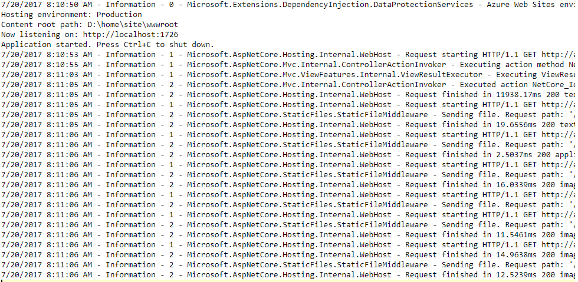

<b>Instruction to implement custom logging in you ASP Net Core Application</b>

1. Add the ICustomLogger file next to the Startup.cs file.
2. Add the below lines in the Startup.cs file and then you can disable the other logging to avoid any duplication of the data.

            loggerFactory.AddColoredConsoleLogger(c=>
            {
                c.LogLevel = LogLevel.Information;
                c.Color = ConsoleColor.White;
            });
3. You can modify the class as per your requirement.
4. Remember you need to redeploy your code to Azure web app after making these changes.
5. You will see logging generated in the below format.

